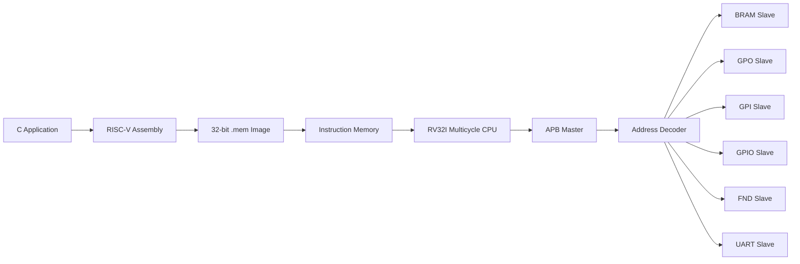

# RV32I Multicycle Processor with AMBA APB Bus

RV32I 기반 멀티사이클 프로세서와 AMBA APB 버스를 직접 설계하고, BRAM·GPIO·UART·7-Segment Display 등의 주변장치를 Memory-Mapped I/O 방식으로 제어하는 임베디드 시스템 프로젝트입니다.

C 언어로 정의한 응용 동작을 RISC-V 명령어와 32-bit machine code로 변환한 뒤 `.mem` 실행 이미지로 저장하여, 직접 구현한 프로세서의 Instruction Memory에서 실행합니다. CPU가 `lw` 또는 `sw` 명령어를 실행하면 APB Master가 버스 트랜잭션을 생성하고 선택된 APB Slave를 제어합니다.

## Project Goals

- RV32I 명령어 집합 기반 Multicycle CPU 설계
- CPU의 Fetch, Decode, Execute, Memory, Write-Back 단계 구현
- AMBA APB Master의 `IDLE → SETUP → ACCESS` FSM 구현
- `PREADY` 기반 APB Wait State 및 CPU Stall 처리
- Address Decoder와 PRDATA Multiplexer 구현
- BRAM, GPO, GPI, GPIO, FND, UART 주변장치 통합
- C/Assembly에서 생성한 machine code를 통한 하드웨어 동작 검증

## Block Diagram 


## System Architecture



### Software-to-Hardware Flow

```text
C 동작 정의
    ↓
RISC-V Assembly / Machine Code 생성
    ↓
.mem 파일로 저장
    ↓
Instruction Memory에 적재
    ↓
RV32I CPU가 명령어 실행
    ↓
lw / sw 명령으로 Memory-Mapped I/O 접근
    ↓
APB Master가 SETUP 및 ACCESS 전송 수행
    ↓
선택된 APB Slave가 실제 주변장치 제어
```

## Multicycle CPU

CPU는 한 명령어를 여러 클록에 나누어 처리합니다.

```text
FETCH → DECODE → EXECUTE → MEM → WRITE_BACK
```

- **FETCH**: Instruction Memory에서 명령어를 읽고 IR에 저장
- **DECODE**: opcode와 register operand를 해석
- **EXECUTE**: ALU 연산, 분기 판단 또는 메모리 주소 계산
- **MEM**: BRAM이나 APB 주변장치에 대한 읽기·쓰기 수행
- **WRITE_BACK**: 연산 결과 또는 읽은 데이터를 Register File에 저장

APB 전송이 필요한 명령어는 `MEM` 상태에서 `PREADY`를 기다립니다. Slave가 전송 완료를 알린 후에만 CPU가 다음 상태로 이동하므로, 느린 주변장치가 연결되어도 데이터가 유실되지 않습니다.

## APB Master

APB Master는 CPU의 read/write 요청을 다음 세 상태로 변환합니다.

| State | 동작 |
|---|---|
| `IDLE` | CPU 요청 대기 |
| `SETUP` | `PADDR`, `PWDATA`, `PWRITE`, `PSELx` 설정 |
| `ACCESS` | `PENABLE`을 활성화하고 `PREADY`가 올라올 때까지 대기 |

주요 APB 신호는 다음과 같습니다.

| Signal | Direction | Description |
|---|---|---|
| `PCLK` | Input | APB 동기 클록 |
| `PRESET` | Input | 시스템 리셋 |
| `PADDR[31:0]` | Output | 접근할 Slave와 레지스터 주소 |
| `PSELx` | Output | Address Decoder가 선택한 Slave 활성화 |
| `PENABLE` | Output | APB ACCESS 단계 표시 |
| `PWRITE` | Output | `1`: Write, `0`: Read |
| `PWDATA[31:0]` | Output | Slave에 기록할 데이터 |
| `PRDATA[31:0]` | Input | Slave에서 읽은 데이터 |
| `PREADY` | Input | Slave의 전송 완료 응답 |

## Memory Map

현재 `apb_master.sv`의 Address Decoder를 기준으로 한 대표 base address입니다.

| Slave | Base Address | Function |
|---|---:|---|
| BRAM | `0x1000_0000` | 프로그램 실행 중 사용하는 내부 데이터 메모리 |
| GPO | `0x2000_0000` | 범용 출력 |
| GPI | `0x2000_1000` | 범용 입력 |
| GPIO | `0x2000_2000` | 입출력 방향을 설정할 수 있는 GPIO |
| FND | `0x2000_3000` | 7-Segment Display 제어 |
| UART | `0x2000_4000` | 직렬 송수신 |

### APB GPIO Register Map

| Address | Register | Access | Description |
|---:|---|---|---|
| `0x2000_2000` | `GPIO_CTL` | R/W | 각 GPIO pin의 입력/출력 방향 설정 |
| `0x2000_2004` | `GPIO_ODATA` | R/W | GPIO 출력 데이터 |
| `0x2000_2008` | `GPIO_IDATA` | R | GPIO 입력 데이터 |

## Code Organization

```text
.
├── README.md
└── CPU_APB/
    ├── Assembly Code/
    │   ├── ABP_BRAM_GPO_GPI.mem
    │   ├── APB_FND.mem
    │   ├── APB_GPIO_LED_BLINK.mem
    │   ├── APB_GPO.mem
    │   ├── APB_TEST_C.mem
    │   ├── APB_UART.mem
    │   ├── U_DMEM.mem
    │   ├── riscv_rv32i_rom_data.mem
    │   └── riscv_rv32i_rom_data_sum.mem
    │
    ├── Define code/
    │   └── define.vh
    │
    ├── rv32i_top.sv
    ├── rv32i_cpu.sv
    ├── rv32i_datapath.sv
    ├── innstruction_mem.sv
    ├── apb_master.sv
    ├── BRAM.sv
    ├── APB_GPO.sv
    ├── APB_GPI.sv
    ├── APB_GPIO.sv
    ├── APB_FND_SLAVE.sv
    └── uart_slave.sv
```

### Assembly Code

`Assembly Code` 디렉터리에는 C 또는 Assembly 프로그램으로부터 생성한 32-bit RISC-V machine code 이미지가 저장되어 있습니다. 각 줄은 Instruction Memory에 순서대로 적재되는 하나의 RV32I 명령어입니다.

| File | Verification Target |
|---|---|
| `ABP_BRAM_GPO_GPI.mem` | BRAM, GPO, GPI 통합 접근 |
| `APB_FND.mem` | FND 출력 제어 |
| `APB_GPIO_LED_BLINK.mem` | APB GPIO 설정 및 LED 점멸 |
| `APB_GPO.mem` | GPO 출력 제어 |
| `APB_TEST_C.mem` | C 프로그램 기반 APB 시스템 통합 검증 |
| `APB_UART.mem` | UART Slave 접근 및 송수신 |
| `U_DMEM.mem` | Data Memory 접근 검증 |
| `riscv_rv32i_rom_data.mem` | RV32I 기본 명령어 검증 |
| `riscv_rv32i_rom_data_sum.mem` | 산술 및 누산 동작 검증 |

### Define Code

`Define code/define.vh`에는 CPU 제어기와 Datapath에서 공통으로 사용하는 RV32I 상수가 정의되어 있습니다.

- R-Type, I-Type, Load, Store, Branch, LUI, AUIPC, JAL, JALR opcode
- ADD, SUB, Shift, Compare, XOR, OR, AND ALU operation code
- BEQ, BNE, BLT, BGE, BLTU, BGEU branch operation code

명령어 정의를 RTL 본문에서 분리하여 CPU 제어 로직의 가독성과 유지보수성을 높였습니다.

## My Contribution — APB GPIO LED Blink Program

본 프로젝트에서 **`Assembly Code/APB_GPIO_LED_BLINK.mem` 실행 이미지 제작을 담당하였습니다.**

이 프로그램은 RV32I CPU에서 실행되며 APB GPIO Slave의 레지스터를 Memory-Mapped I/O 방식으로 제어하여 LED가 반복적으로 점멸하도록 구성하였습니다.

### Implemented Flow

```text
GPIO base address 설정: 0x2000_2000
        ↓
GPIO_CTL 레지스터를 통해 LED pin을 출력 모드로 설정
        ↓
GPIO_ODATA에 LED ON/OFF 데이터 기록
        ↓
Software delay loop 실행
        ↓
출력 값을 반전하고 반복
```

### Contribution Details

- LED blink 동작을 수행하는 프로그램 흐름 구성
- GPIO Control 및 Output Data 레지스터에 대한 주소 설정
- C/Assembly 동작을 RV32I 32-bit machine code로 변환
- Instruction Memory에서 사용할 `.mem` 이미지 생성
- `sw` 명령어가 APB Write transaction으로 변환되는 과정 검증
- `PSEL_GPIO`, `PWRITE`, `PENABLE`, `PWDATA`, `PREADY` 동작 확인
- CPU의 software delay loop와 GPIO 출력 변화 확인

이 구현을 통해 다음 경로가 정상적으로 연결되는지 검증할 수 있습니다.

```text
RV32I Instruction
    → CPU Datapath/Control Unit
    → APB Master
    → Address Decoder
    → APB GPIO Slave
    → LED Output
```

## Selecting a Program Image

실행할 `.mem` 파일은 `innstruction_mem.sv`의 `$readmemh`에서 선택합니다. `CPU_APB` 디렉터리를 시뮬레이션 기준 경로로 사용하는 경우 LED blink 이미지는 다음과 같이 지정할 수 있습니다.

```systemverilog
initial begin
    $readmemh("Assembly Code/APB_GPIO_LED_BLINK.mem", rom);
end
```

저장소 root에서 시뮬레이터를 실행한다면 다음 경로를 사용합니다.

```systemverilog
$readmemh("CPU_APB/Assembly Code/APB_GPIO_LED_BLINK.mem", rom);
```

시뮬레이터가 공백이 포함된 경로를 올바르게 처리하지 못하면 `.mem` 파일을 simulation working directory에 추가하고 파일명만 지정할 수 있습니다.

## Define File 

`rv32i_cpu.sv`와 `rv32i_datapath.sv`는 다음 include 문을 사용합니다.

```systemverilog
`include "define.vh"
```

따라서 컴파일 시 `CPU_APB/Define code`를 SystemVerilog include directory로 추가해야 합니다. 다른 방법으로는 소스의 include 경로를 다음과 같이 변경할 수 있습니다.

```systemverilog
`include "Define code/define.vh"
```

## Verification Points

1. CPU가 `.mem`의 명령어를 순서대로 Fetch하는지 확인
2. `sw` 또는 `lw` 명령에서 CPU가 `MEM` 상태로 진입하는지 확인
3. APB Master가 `IDLE → SETUP → ACCESS` 순서로 천이하는지 확인
4. 주소에 대응하는 단 하나의 `PSELx`만 활성화되는지 확인
5. `PREADY`가 활성화될 때 CPU의 bus transaction이 완료되는지 확인
6. GPIO, FND, UART 등 대상 Slave의 레지스터 값이 변경되는지 확인
7. `APB_GPIO_LED_BLINK.mem` 실행 시 GPIO 출력이 일정 간격으로 반복 전환되는지 확인

## Key Learning Outcomes

- RV32I ISA와 Multicycle CPU Datapath의 연계 이해
- C/Assembly 프로그램과 machine code 실행 흐름 이해
- Memory-Mapped I/O 기반 주변장치 제어
- APB Master와 Slave의 handshake 및 wait-state 처리
- CPU, bus, memory, peripheral을 통합한 소형 임베디드 SoC 설계
